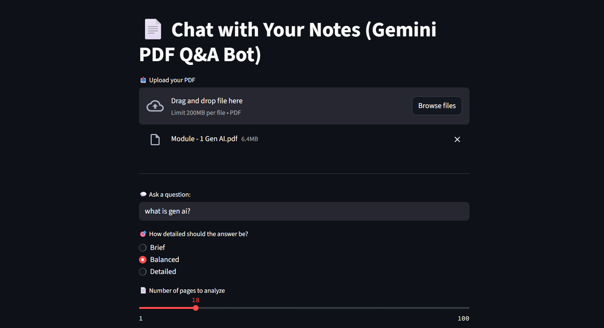
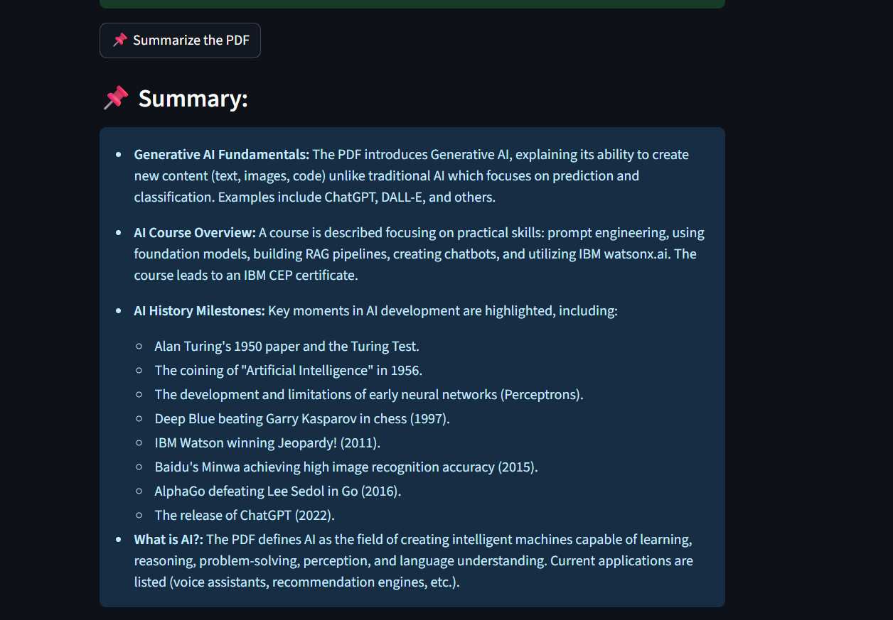
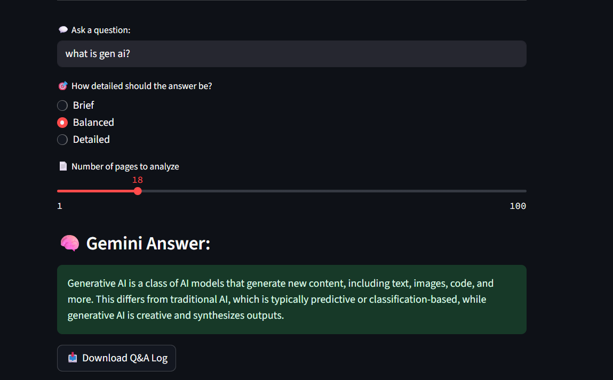
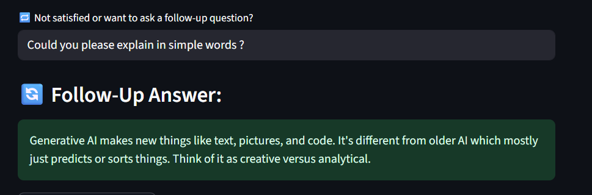

# 📄 Chat with Your Notes (Gemini PDF Q&A Bot)

An AI-powered PDF assistant that allows users to upload documents and ask detailed or summary-level questions.  
Built using **Streamlit** and **Google's Gemini API**, it offers follow-up Q&A, contextual responses, and an elegant, dark-themed interface.

---

## 🧠 Features

- 📤 Upload PDF files and extract meaningful text
- 💬 Ask any question based on PDF content
- 🔄 Ask follow-up questions for deeper clarification
- 📌 Summarize PDFs in simple bullet points
- 💾 Download Q&A chat logs
- 🎨 Clean, responsive, and dark-themed UI with vibrant color accents

---

## 🚀 Tech Stack

| Technology | Purpose |
|------------|---------|
| [Streamlit](https://streamlit.io/) | UI and frontend |
| [Google Generative AI (Gemini)](https://ai.google.dev/) | Language model for answering |
| [PyMuPDF (fitz)](https://pymupdf.readthedocs.io/) | PDF reading |
| [dotenv](https://pypi.org/project/python-dotenv/) | Secure API key management |

---

## ⚙️ Setup Instructions

1. **Clone the Repository**

   ```bash
   git clone https://github.com/your-username/chat-with-your-notes.git
   cd chat-with-your-notes
   
2. Create Virtual Environment
    python -m venv venv
   venv\Scripts\activate  # Windows

3. Install Dependencies
pip install -r requirements.txt

4. Set Your API Key
Create a file named .env in the root directory
Add your Gemini API Key 

5. Run the Application
streamlit run main.py
 
## 📸 Screenshots 


### 🏠 Homepage



### 📄 Summary Feature



### ❓ Ask a Question



### 🔁 Follow-up / Throwback Question



🧠 How to Use
Upload a PDF using the uploader section.

Ask any question about the document.

Choose how detailed you want the answer to be.

Not satisfied? Ask follow-up questions immediately.

Want a quick summary? Click the Summarize button.

Download your chat log anytime.

📝 License
This project is licensed under the MIT License.
